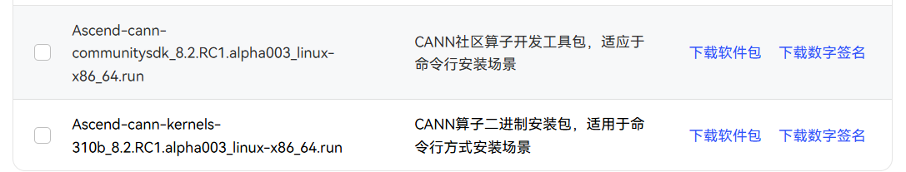
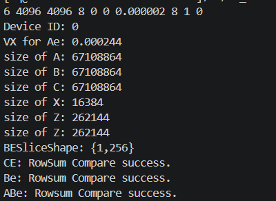
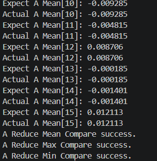
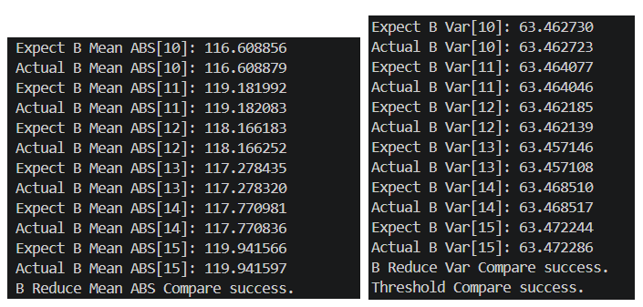
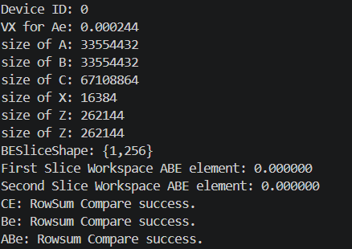
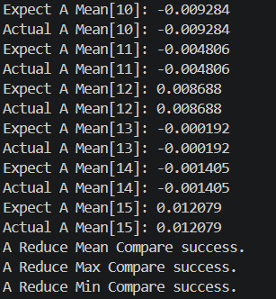
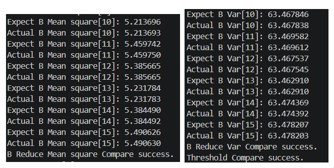
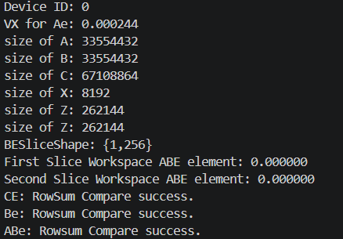
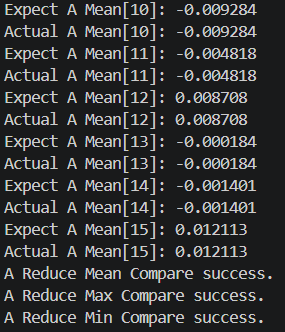
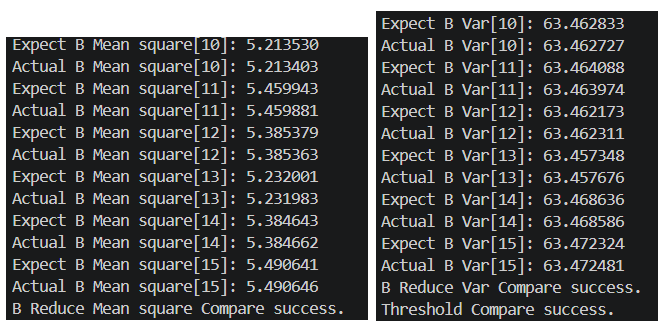

# FT-GEMM\_invidiual
基于Catalss以及我们之前提出的AscendFT-GEMM融合容错算子，我们给出了基于V-ABFT的GEMM容错算子的外挂版本，即该版本不执行矩阵乘法，但是执行除矩阵乘法以外的包括阈值估计、checksum 生成、校验检测等错误检测功能，最终生成bit流代表各block各行的计算结果是否正确，出现0则代表着计算结果有误。因为在我们的代码中，目前假设输入A,B,C是任意矩阵，因此输出大量0bit，而在实际落地时，当 $C = A \times B$ 的情况下，可以如同之前的融合算子（见[AscendFT-GEMM开源库](https://github.com/citsjtu2020/AscendFT-GEMM)）一样保证正确校验。

核心block-level的代码可见：

examples/cube_op_self/gemm/block/block_mmad_pingpong_fault_abe_spec_no_splitk_robust.hpp; 

核心kernel-level的代码可见：

examples/cube_op_self/gemm/kernel/matmul_epilogue_asvar_thre_abft_no_splitk_aic_aiv_pipe_mixed_split_robust_preload.hpp

## Running examples of FT-GEMM\_individual
目前，我们的外挂版算子可以支持FP16, BF16和FP32的精度，我们给出运行实例，提供了具体的运行脚本，

### 0. Install CANN Environment
#### 0.1) prepare the hardware
该外挂算子支持 Ascend 910B/910C NPU. 同时请保证使用的服务器正确安装了 npu-driver 和 npu-firmware。
#### 0.2) install the software environment
##### 0.2.1) Download the packages
我们推荐使用 CANN 8.2.1 环境. 请在该网址下载相应源： [Ascend resouce download center](https://www.hiascend.com/developer/download/community/result?module=cann&cann=8.2.RC1.alpha003), 并下载 toolkit 和 kernel package:

  
   
  <em>Figure 1: Required Package In the List</em>

之后将其上传到服务器的指定路径 (e.g., ${HOME})

##### 0.2.2) Increase the execution permissions for the software package

chmod +x Ascend-cann-toolkit_8.3.RC1.alpha003_linux-aarch64.run

chmod a+x Ascend-cann-kernels-910b_8.2.RC1.alpha003_linux-aarch64.run

##### 0.2.3) Install the packages:

./Ascend-cann-toolkit_8.3.RC1.alpha003_linux-aarch64.run --install

./Ascend-cann-kernels-910b_8.2.RC1.alpha003_linux-aarch64.run --install

##### 0.2.4) Add the configuration to the PATH:
安装后，其安装路径中的相关配置文件为： "set_env.sh" (当前安装路径为：${HOME}/Ascend)。

###### a) Add the configuration to the ${HOME}/.bashrc:

export ASCEND_HOME_PATH=${HOME}/Ascend/ascend-toolkit/latest

export ASCEND_CANN_PACKAGE_PATH=${HOME}/Ascend/latest

export ASCEND_INSTALL_PATH=${HOME}/Ascend/ascend-toolkit/latest

export ASCEND_HOME_DIR=${HOME}/Ascend/ascend-toolkit/latest

source ${HOME}/Ascend/ascend-toolkit/set_env.sh

###### b) Make the configuration take effect:

source .bashrc (or just: source ${HOME}/Ascend/ascend-toolkit/set_env.sh)

### 1. Run the code:

#### 1.1 Compiling Code

将代码下载到服务器中（以 ${HOME}为例）:

##### a) enter the path: 

${HOME}/AscendFT-GEMM/

##### b) Build the executable file:

bash scripts/build.sh 18_matmul_ft_abe_aic_thre_no_splitk_asvar_ft_split_fp32_robust_preload_inited (for FP32 precision)

bash scripts/build.sh 18_matmul_ft_abe_aic_thre_no_splitk_asvar_ft_split_bf16_robust_preload_inited (for BF16 precision)

bash scripts/build.sh 18_matmul_ft_abe_aic_thre_no_splitk_asvar_ft_split_fp16_robust_preload_inited (for FP16 precision)

#### 1.2 Run Code

##### 1.2.1 Params:

The abstracted command-line parameter instructions can be expressed as follows:
18_matmul_ft m n k rt beta thre_type e_max red_cores split_ks [device_id]"

| Item | Discription | Rquired/Optional|
|------|------------|------------|
| m | outer row dimension size|Rquired|
| n | outer column dimension size|Required|
| k | reduction dimension size |Rquired|
| rt| The exponential coefficient in A-ABFT, 8 by default|Required|
|beta|The base coefficient in A-ABFT, 0 by default| Required|
|thre_type| The threshold type in A-ABFT, 0 by default|Required|
|e_max|The constant coefficient in the V-ABFT formula, BF16: 0.001; FP32: 0.0000022|Required|
|red_cores| The number of AI cores used when computing the local aggregation results for each block tile of matrix B,  it is recommended to be set as 8|Required|
| split_ks |For blocks to compute ABe on AIC cores, we now support to apply the Split-K mechanism only on these blocks for further speedup when m and n is kindly small or medium(e.g.,m,n<4096), when adopting local split-K scheme, it is recommended to be set as 2; Otherwise, please set it as 1|Required|
| device_id | ID of NPU card,0~7 |Optional|

##### 1.2.2 FP32 Precision:

a) Run the examples ($M\times N \times K = 4096^{3}$):

cd output/bin/

./18_matmul_ft_abe_aic_thre_no_splitk_asvar_ft_split_fp32_robust_preload_inited 409
6 4096 4096 8 0 0 0.000002 8 1 0

Results:

  
   
  <em>Figure 2: FT-GEMM results (FP32) of checksum generation (verified by comparing with CPU results)</em>

  
   
  <em>Figure 3: FT-GEMM results (FP32) of Matrix A Reduction (verified by comparing with CPU results)</em>

  
   
  <em>Figure 4: FT-GEMM results (FP32) of Matrix B Reduction and Threshold Computation (verified by comparing with CPU results)</em>

##### 1.2.3 BF16 Precision:

a) Run the examples  ($M\times N \times K = 4096^{3}$):
cd output/bin/

./18_matmul_ft_abe_aic_thre_no_splitk_asvar_ft_split_bf16_robust_preload_inited 4096 4096 4096 8 0 0 0.001 8 1 0

Results:

  
   
  <em>Figure 2: FT-GEMM results (BF16) of checksum generation (verified by comparing with CPU results)</em>

  
   
  <em>Figure 3: FT-GEMM results (BF16) of Matrix A Reduction (verified by comparing with CPU results)</em>

  
   
  <em>Figure 4: FT-GEMM results (BF16) of Matrix B Reduction and Threshold Computation (verified by comparing with CPU results)</em>

##### 1.2.3 FP16 Precision:

a) Run the examples  ($M\times N \times K = 4096^{3}$):
cd output/bin/

./18_matmul_ft_abe_aic_thre_no_splitk_asvar_ft_split_fp16_robust_preload_inited 4096 4096 4096 8 0 0 0.008 8 1 0

Results:

  
   
  <em>Figure 2: FT-GEMM results (FP16) of checksum generation (verified by comparing with CPU results)</em>

  
   
  <em>Figure 3: FT-GEMM results (FP16) of Matrix A Reduction (verified by comparing with CPU results)</em>

  
   
  <em>Figure 4: FT-GEMM results (FP16) of Matrix B Reduction and Threshold Computation (verified by comparing with CPU results)</em>

